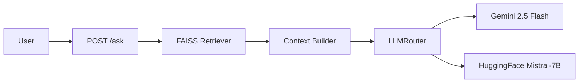

# Python Q&A Assistant

A production-oriented Python question answering assistant built with FastAPI and RAG. It grounds answers in Stack Overflow Python Q&A data and routes between Gemini 2.5 Flash and HuggingFace Mistral-7B for resilient generation.

## Architecture



User -> POST /ask -> FAISS Retriever -> Context -> LLMRouter

LLMRouter prefers Gemini 2.5 Flash first. If Gemini hits its free-tier quota or returns a quota-related error, the router switches to HuggingFace Mistral-7B, then retries Gemini after one hour.

## Fallback Behavior

If Gemini hits its free tier quota (429/ResourceExhausted), the system automatically switches to HuggingFace Mistral-7B. After 1 hour, it retries Gemini. No manual intervention is needed. Check GET /llm-status to see which provider is currently active.

## Setup

1. Clone the repository.
2. Create a virtual environment and install dependencies.
3. Copy `.env.example` to `.env` and fill in your API keys.
4. Download the Stack Overflow Python questions and answers CSV files into `data/`.
5. Build the vector index.
6. Start the API server.

```bash
python -m pip install -r requirements.txt
python scripts/build_index.py
uvicorn app.main:app --reload
```

## API Docs

| Endpoint | Method | Description |
| --- | --- | --- |
| `/` | GET | Service landing response |
| `/api/v1/health` | GET | Health check and active LLM status |
| `/api/v1/llm-status` | GET | Current LLM router state |
| `/api/v1/examples` | GET | Five sample Python questions |
| `/api/v1/ask` | POST | Retrieve grounded answers from the vector store |

## Testing

Run the test suite with:

```bash
pytest tests/ -v
```

## Deployment

Deploy to Hugging Face Spaces with the included `Dockerfile`.

Deployed URL: https://huggingface.co/spaces/your-username/python-qa-assistant

## Scaling

For 100+ concurrent users:

- Run multiple async workers with `uvicorn --workers 4`.
- Add Redis caching for repeated questions with a 1 hour TTL.
- Move to Pinecone or Weaviate for distributed vector search.
- Support provider load balancing across multiple Gemini API keys.

Estimated cost: $0 at current scale, and roughly $X/month at 100k queries with Gemini Pro, depending on prompt length and retrieval volume.
